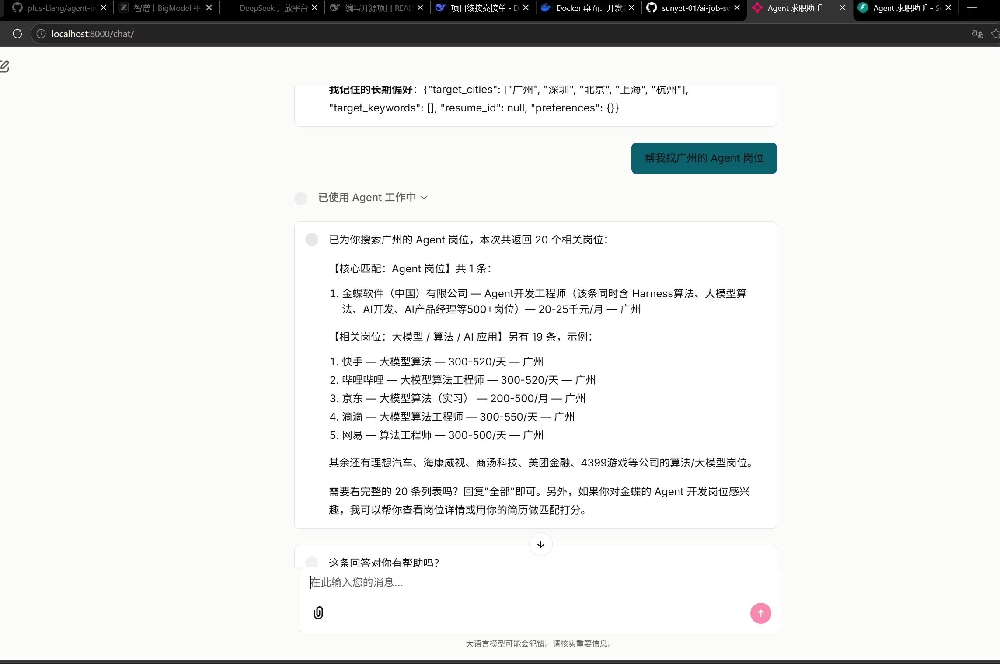
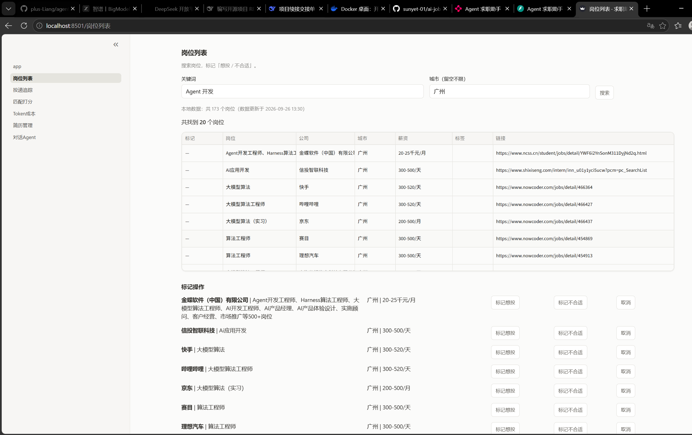
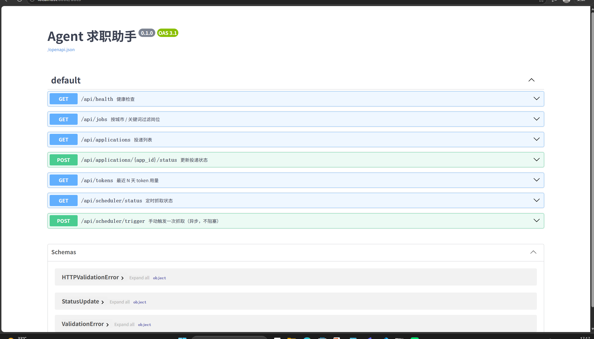
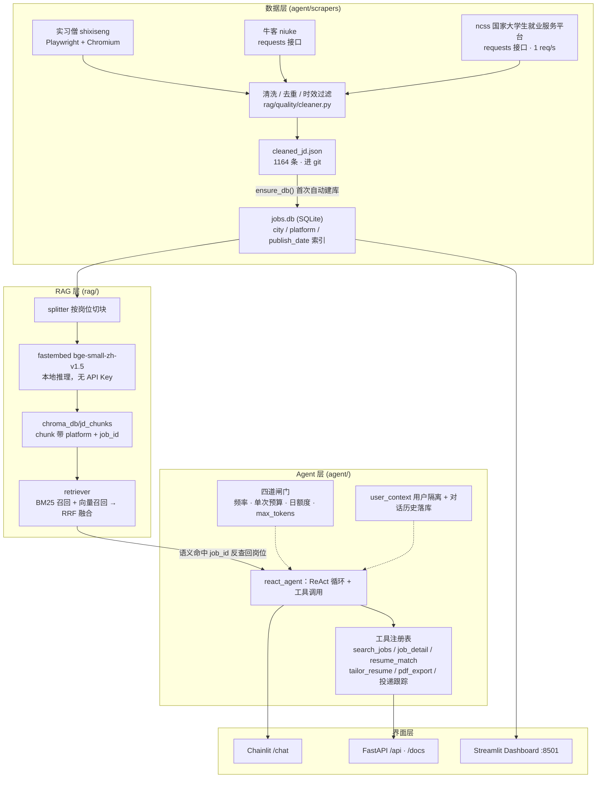

# agent-intern-roadmap

> **部署提示**：Hugging Face Spaces 只读取仓库根目录的 `README.md` 作为 Space 配置，
> 因此本文件顶部的 YAML frontmatter（`sdk: docker` / `app_port: 7860`）必须保留，
> 不要删除或下移。

**一个能自己更新数据的求职 Agent**：三平台抓岗位 → 清洗入库 → 混合检索（BM25 + 向量）→ ReAct 对话，
再配一个投递追踪看板和一组 REST 接口。





---

## 1. 项目简介

求职这件事可以拆成流水线：**找岗位 → 判断匹配度 → 投递 → 跟踪结果**。
这个项目把每一段都做成可运行的一层，用同一个 Agent 串起来：

| 层 | 干什么 | 主要入口 |
|---|---|---|
| 数据层 | 抓实习僧 / 牛客 / 国家大学生就业服务平台（ncss，原 24365），清洗去重后落 `cleaned_jd.json` + SQLite | `agent/scrapers/scheduler.py` |
| RAG 层 | 岗位 JD 切块 → 本地 embedding 入库 → BM25 + 向量 RRF 融合检索（模糊需求走语义重排） | `rag/retriever.py`、`rag/vector_store.py` |
| Agent 层 | ReAct 循环 + 工具调用：搜岗位 / 看详情 / 简历匹配打分 / 改简历 / 投递跟踪 / 模拟面试 | `agent/react_agent.py`、`agent/tools_registry.py` |
| 界面层 | Chainlit 对话、FastAPI + Swagger、Streamlit 数据看板 | `main.py`、`dashboard/app.py` |

仓库自带的 `rag/data/cleaned_jd.json` 有 **1164 条** 真实岗位（含六城分布），clone 下来即可检索，
不需要先跑爬虫。**要跑起来只需要一个智谱 API Key**（对话模型；embedding 是本地模型，不花钱）。

启动后四个入口：

| 路径 | 是什么 |
|---|---|
| `http://localhost:8000/` | 首页（对话 / 看板 / API 三张卡片） |
| `http://localhost:8000/chat` | Chainlit 对话 Agent |
| `http://localhost:8000/docs` | FastAPI 自动生成的 API 文档（Swagger UI，可直接在线调试） |
| `http://localhost:8501` | Streamlit Dashboard（岗位列表 / 投递追踪 / 匹配打分 / Token 成本 / 简历管理 / 对话 Agent） |

---

## 2. 架构图



数据流一句话：**抓取 → 清洗 → JSON（进 git）→ SQLite（自动建）→ 向量库（一条命令重建）→ 检索 → Agent → 界面**。

---

## 3. 快速开始

### 方式 A：Docker（一条命令）

```bash
git clone https://github.com/plus-Liang/agent-intern-roadmap.git
cd agent-intern-roadmap
cp .env.example .env          # 打开 .env，把 ZHIPU_API_KEY 填上
docker compose up --build     # 访问 http://localhost:8000
```

- `docker-compose.yml` 里 `env_file: .env` 是**必需**的，没有 `.env` 会直接启动失败。
- 端口映射是 `8000:7860`（容器内固定 7860，与 HF Space 的 `app_port` 一致）。
- 已挂卷：`./rag/data`（数据）与命名卷 `chroma_db`（向量库）。
- 只跑 FastAPI + Chainlit，**不含 Streamlit Dashboard 与 Playwright**，所以首页的看板卡片在容器里点不开。
- 基础镜像与运行环境统一在 **Python 3.12**：`Dockerfile` 用 `python:3.12-slim`，
  `runtime.txt` 写 `python-3.12`，与 `numpy==2.5.3`（没有 3.11 wheel）的要求一致。

### 方式 B：本地 pip（两步）

**第 1 步：装依赖 + 配置 Key。** 需要 **Python 3.12+**（`numpy 2.5.3` 没有 3.11 的 wheel）。

```bash
pip install -r requirements.txt
cp .env.example .env      # 只需填 ZHIPU_API_KEY，其余留空即用默认值
```

Key 在 <https://open.bigmodel.cn/> 申请（`glm-5.3-flash` 有免费额度）。embedding 走本地
`fastembed`，首次使用会自动下载 `BAAI/bge-small-zh-v1.5`（约 90MB），不需要任何 embedding Key。

**第 2 步：起服务。**

```bash
python start.py
```

`start.py` 会同时拉起两个进程：`http://localhost:8000`（首页 / `/chat` / `/docs`）和
`http://localhost:8501`（Dashboard），Ctrl+C 一起停。

也可以只起 Web 服务（不要 Dashboard）：

```bash
python main.py                 # 等价于 uvicorn main:app --host 0.0.0.0 --port 8000
```

> 必须在**项目根目录**启动：Chainlit 要读到 `.chainlit/` 与 `chainlit.md`。
> Dashboard 单独启动请用 `streamlit run dashboard/app.py`（不要用 `python -m streamlit`，会因模块遮蔽报错）。

### 可选但推荐：建向量索引

`chroma_db/` 不进 git，新 clone 下来是空的。不建也能跑（`search_jobs` 会退回 SQLite 关键词检索），
但**模糊需求那类查询（"想找偏大模型落地、能写工程代码的实习"）拿不到语义结果**。建一次即可：

```bash
python -m rag.vector_store --rebuild      # 从 jobs.db 全量重建（约几分钟，本地 embedding）
```

`jobs.db` 同样不进 git，但**不需要手动建**：`rag/data/db.py:ensure_db()` 会在它不存在时
自动从 `cleaned_jd.json` 建库（`cleaned_jd.json` 比库新时也会自动增量同步）。

### Hugging Face Space 部署

- 顶部 frontmatter 的 `sdk: docker` / `app_port: 7860` 就是 Space 配置，**不能删**。
- 变量在 Space 的 **Settings → Variables and secrets** 里配置，变量名以 `.env.example` 为准。
- 镜像以 UID 1000 的非 root 用户运行；容器文件系统是临时的，`jobs.db`、`logs/`、
  `agent/data/*.db` 重启即丢，需长期保存请挂持久卷或外部数据库。

---

## 4. 配置说明

全部变量见仓库根目录的 [`.env.example`](.env.example)，复制成 `.env` 后按需打开注释。
下表逐变量一句话，**除 `ZHIPU_API_KEY` 外都有可用的默认值**。

### 模型

| 变量 | 说明 |
|---|---|
| `ZHIPU_API_KEY` | **必填**。对话模型的 Key，缺失时 `shared/config.py:check_config()` 直接报错 |
| `ZHIPU_BASE_URL` | 智谱 API 地址，默认 `https://open.bigmodel.cn/api/paas/v4` |
| `ZHIPU_CHAT_MODEL` | 对话模型名，默认 `glm-5.3-flash` |
| `LOCAL_EMBEDDING_MODEL` | 本地 embedding 模型，默认 `BAAI/bge-small-zh-v1.5`（无需 Key） |
| `USE_RERANKER` | 是否启用重排器，默认 `false`（开启需要 torch / sentence-transformers） |

### 对话与多用户

| 变量 | 说明 |
|---|---|
| `CHAT_HISTORY_DB` | 对话历史库路径，默认 `agent/data/chat_history.db` |
| `CHAT_HISTORY_STORE_STEPS` | 是否把工具调用过程也落库，默认 `false`（只存问答） |
| `CHAT_AUTH_ENABLED` | 是否开启登录，默认 `false`（不开时所有人归到默认用户 `local`） |
| `CHAT_ADMIN_USER` | 管理员用户名，默认 `admin` |
| `CHAT_ADMIN_PASSWORD` | 管理员密码，**没有默认值**：开了认证却不设会直接启动失败（刻意如此） |
| `CHAINLIT_AUTH_SECRET` | Chainlit 的 JWT 签名密钥，不设会自动生成并落到 `agent/data/.chainlit_secret` |
| `MAX_HISTORY` | 每轮注入的历史消息条数上限，留空用代码默认 |

### 限流与成本控制（四道闸门）

| 变量 | 说明 |
|---|---|
| `RATE_LIMIT_ENABLED` | 四道闸门的总开关，默认 `true`；置 `false` 时**四道全关**（含 `max_tokens` 与单次预算） |
| `RATE_PER_MIN` | 闸门 3 单用户频率：每分钟补充的请求数，默认 6 |
| `RATE_BURST` | 闸门 3 令牌桶容量（允许连发几次），默认 3 |
| `LLM_MAX_TOKENS` | 闸门 1 单次输出上限，默认 1024，`0` = 不限 |
| `RUN_TOKEN_BUDGET` | 闸门 2 单次请求累计 token 上限，默认 30000，触顶**降级收尾不拒绝请求** |
| `DAILY_TOKENS_PER_USER` | 闸门 4 单用户日额度，默认 200000，`0` = 不限 |
| `GLOBAL_DAILY_TOKENS` | 闸门 4 全局日额度，默认 2000000，`0` = 不限 |
| `MAX_CONCURRENCY` | 全局并发上限（`asyncio.Semaphore`），默认 3 |

> 两个已知点：**日额度默认值偏小**（2M 只够约 10 个满额度用户），公开试用前需按真实消耗重估；
> **`max_tokens` 目前和总开关耦合**，想"只关限流、保留输出上限"需要把它拆成独立开关（待实现）。

### 路径

| 变量 | 说明 |
|---|---|
| `FASTEMBED_CACHE_PATH` | embedding 模型缓存目录，默认 `~/.cache/fastembed`；容器里建议指到持久盘 |
| `TOKEN_DB_PATH` | 用量库路径（日额度的真相源，重启不丢），默认 `logs/token_usage.db` |
| `FEEDBACK_DB_PATH` | 用户反馈库路径，默认 `logs/feedback.db` |

### 抓取（只有自己更新数据时才需要）

| 变量 | 说明 |
|---|---|
| `SCHEDULER_PLATFORMS` | 抓取平台，默认 `shixiseng,niuke,ncss` |
| `SCHEDULER_CITY` | 城市池，默认 `广州,深圳,北京,上海,杭州,成都` |
| `SCHEDULER_KEYWORDS` | 关键词池，留空则用 `config/scraping.yaml` 里的 59 个全行业词 |
| `SCHEDULER_BATCH_SIZE` | 单晚抓取组合数，默认 180（`0` = 全量，很慢，别用） |
| `SCHEDULER_CHUNK_SIZE` | 进度日志的打印间隔（每 N 个组合一行），默认 12，`0` = 不分块 |

> 城市池 / 关键词池的完整配置在 [`config/scraping.yaml`](config/scraping.yaml)，
> 环境变量优先级高于该文件。另外代码还读三个 `.env.example` 未列的变量：
> `SCHEDULER_HOUR` / `SCHEDULER_MINUTE`（Web 服务内置定时抓取的时刻，默认 03:00）、
> `SCHEDULER_RUN_ON_STARTUP`（启动时立刻抓一次，默认关）。

---

## 5. 数据说明

**clone 下来就能用，不用先爬。**

| 项 | 现状 |
|---|---|
| `rag/data/cleaned_jd.json` | **1164 条**，进 git（约 2MB），clone 即有 |
| 平台分布 | 实习僧 `shixiseng` 710 / 国家大学生就业服务平台 `ncss` 338 / 牛客 `niuke` 116 |
| 六城分布 | 上海 / 北京 / 深圳 / 杭州 / 成都 / 广州 六城为主，另有少量「全国」岗位 |
| 字段 | `platform` `job_id` `title` `company` `city` `salary` `url` `description` `publish_date` |
| `rag/data/jobs.db` | **不进 git**，首次查询时由 `ensure_db()` 自动从 JSON 建库（幂等） |
| `chroma_db/` | **不进 git**，需要 `python -m rag.vector_store --rebuild` 建一次（见第 3 节） |
| 运行期数据 | `logs/`、`agent/data/*.db`、`agent/data/user_profile.json` 均在 `.gitignore` 里 |

几点口径：

- **权威数据源是 `cleaned_jd.json`**。`jobs.db` 是它的 SQLite 镜像，只增不删；
  当 JSON 因清洗/去重摘掉记录时，库里可能残留少量旧条目（历史实测 1174 vs 1164）。
  新 clone 不存在这个问题，从头建库即为 1164 条。
- **清洗门槛按平台配置**：`rag/quality/cleaner.py:PLATFORM_MIN_DESC_LEN = {"ncss": 100}`，
  其余平台沿用全局 200 字。原因是 ncss 上有约四分之一岗位的"职位详情"是空壳（只剩标题回显），
  100 字门槛能拦掉空壳、又不误伤 100–199 字的精炼 JD。
- **抓取覆盖面是滚动的**：全池 = 3 平台 × 6 城 × 59 词 = **1062** 个组合，
  默认每晚 180 个组合，约 6 晚覆盖一轮；进度记在 `scrape_history` 表里。
- **ncss 有全局 1 req/s 限速**，且每个岗位要多请求一次详情页，所以它是最慢的平台
  （实测 60 个组合 12–63 分钟，抖动大）；实习僧约 12.5s/组合，牛客约 1.5s/组合。

---

## 6. 常见问题

### Q1. 没有 API Key 能跑吗？

页面能起来、能浏览 Dashboard，但**对话、匹配打分、改简历这些要调 LLM 的功能都用不了**——
`shared/config.py` 在缺 Key 时会抛 `ConfigError`。申请地址 <https://open.bigmodel.cn/>，
`glm-5.3-flash` 有免费额度，个人试用足够。Embedding 不用 Key（本地 fastembed）。

### Q2. 岗位数据怎么更新？

三种方式，按需要挑：

1. **手动跑一次抓取**（最直接，见 Q3）。
2. **Web 服务内置定时任务**：`main.py` 启动时会挂 APScheduler，每天 `SCHEDULER_HOUR:SCHEDULER_MINUTE`
   （默认 03:00）自动跑一次；也可以 `GET /api/scheduler/status` 看状态、
   `POST /api/scheduler/trigger` 立刻触发一次（异步，不阻塞）。
3. **GitHub Actions**：`.github/workflows/daily_scrape.yml` 每天 UTC 19:00（北京 03:00）跑一次并 commit 回仓库。
   用它需要在仓库 Secrets 里配 `ZHIPU_API_KEY`，并按需改里面的城市列表。

抓完会顺带入库：JSON → `jobs.db` 全量对齐 → 向量库**增量**写入（只重算新增/改动的 chunk，省额度）。

### Q3. 抓取怎么跑？

抓取依赖 Playwright + Chromium，**不在 `requirements.txt` 里**，单独装：

```bash
pip install -r requirements-crawl.txt
python -m playwright install chromium
python -m agent.scrapers.scheduler --once       # 真实抓取，按 batch_size 抓一批
```

常用参数与技巧：

```bash
python -m agent.scrapers.scheduler --status      # 看上次运行结果与滚动覆盖进度
python -m agent.scrapers.scheduler --selftest    # 15 项离线自检，不联网、不写盘
python -m agent.scrapers.scheduler --dry-run     # 只打印将要抓的组合，不真抓
```

- 想快速验证链路又不联网：`SCHEDULER_USE_MOCK=1 python -m agent.scrapers.scheduler --once`。
- **耗时预期**：单晚 180 个组合，实测量级 **30–60 分钟**（ncss 有 1 req/s 限速且会抖动）。
- 抓取会写 `rag/data/cleaned_jd.json`、`rag/data/scraped_jd.txt`、`jobs.db` 与向量库。
- 沙箱 / 服务器上跑 Playwright 可能因权限起不来浏览器（Windows 上是 `WinError 5`），
  需要给它足够的权限或换带桌面的环境。

### Q4. 多用户怎么开？

```bash
# .env 里
CHAT_AUTH_ENABLED=true
CHAT_ADMIN_PASSWORD=<你自己的密码>      # 不设会直接启动失败，这是刻意的
CHAINLIT_AUTH_SECRET=<随机串>           # 可选，不设会自动生成并落盘

python -m agent.chat_history adduser <用户名> <密码>      # 加号
python -m agent.chat_history setpass <用户名> <新密码>    # 改密
python -m agent.chat_history listusers                    # 列号
```

开启后：每个用户的对话历史、画像、简历、投递记录、岗位标记**互相隔离**（`contextvars` 传递当前用户），
对话按 `user_id` 固定 thread，刷新页面 / 重启进程都能续接。

两个限制（都是**已知待实现**，上生产前要知道）：

- **限流的频率桶是进程内的**，多 worker / 多副本会各自计一份，限流失真。
  `docker-compose.yml` 因此固定 `--workers 1`。要横向扩副本，需把桶换成 Redis 或落库滑动窗口。
- **`MAX_CONCURRENCY` 目前只是"压住"并发**：`run_agent` 还在事件循环里同步阻塞，
  真正并行要把 Agent 移进 `to_thread` + 线程池（连带处理 ContextVar 继承）。

### Q5. 端口冲突 / 端口怎么改？

| 端口 | 谁在用 | 怎么改 |
|---|---|---|
| 8000 | `main.py` / `uvicorn main:app`（首页、`/chat`、`/docs`） | `python main.py` 里改 `port`，或直接 `uvicorn main:app --port 8080` |
| 8501 | Streamlit Dashboard | `start.py` 的 `SERVICES`，或 `streamlit run dashboard/app.py --server.port 8502` |
| 7860 | 容器内 uvicorn / HF Space `app_port` | 改 `Dockerfile` 的 `CMD`、`docker-compose.yml` 的 `ports: "8000:7860"` 左值 |

改完记得同步首页卡片与 `docker-compose.yml` 里写死的 `localhost:8501` 链接。

### Q6. 语义检索没结果 / 首页看板卡片点不开？

- **语义检索为空**：多半是 `chroma_db/` 还没建（不进 git）。跑一次
  `python -m rag.vector_store --rebuild`。不建也能用关键词检索，只是模糊需求效果差。
- **看板卡片点不开**：首页第二张卡片指向 `http://localhost:8501`，容器部署里没有 Streamlit，
  这是本地开发约定。本地用 `python start.py` 起就有。

---

## 7. 测试怎么跑

全部测试都是**离线**的：不联网、不调真 LLM、不写 `rag/data/` 与真实向量库，
临时文件落在各自的一次性目录里。

```bash
# ① 调度器 / 全链路自检（15 项，不联网不写盘）
python -m agent.scrapers.scheduler --selftest

# ② 离线回归测试（4 个文件，直接当脚本跑）
python agent/tests/test_round9_fixes.py      # 合并落盘 / 关键词组 / limit / 多城市 / 孤儿清理
python agent/tests/test_ncss_offline.py      # ncss 城市映射 / 字段映射 / 限速 / 未收录城市不瞎猜
python agent/tests/test_chat_history.py      # 对话历史建库 / 续接 / 快照 / 多用户
python agent/tests/test_limits.py            # 四道闸门 / 日额度 / 单次预算 / 总开关

# ③ 端到端验证脚本
python scripts/verify_rag_e2e.py             # 模糊查询走语义、精确查询走 SQL、job_id 反查闭环
python scripts/verify_heal.py                # 实习僧浏览器故障自愈逻辑（不需要真浏览器）

# ④ 数据审计（只读）
python scripts/audit_data.py                 # 数据质量统计
```

注意事项：

- **Windows 上先设 UTF-8 输出编码**：测试会打印 `✗` 之类的符号，默认 GBK 控制台会
  `UnicodeEncodeError`，退出码变成 1（看起来像失败，其实是打印挂了）。

  ```bat
  set PYTHONIOENCODING=utf-8
  python agent/tests/test_round9_fixes.py
  ```

  PowerShell 用 `$env:PYTHONIOENCODING='utf-8'`；也可以 `set PYTHONUTF8=1`（解释器级 UTF-8 模式）。
- 测试会在 `agent/tests/` 下建 `_tmp_*` 临时目录，需要该目录**有写权限**；
  否则会看到 `unable to open database file` / `PermissionError`。
- `scripts/verify_rag_e2e.py` 与 `scripts/verify_heal.py` 用 `Path(__file__)` 自己定位仓库根，
  换机器 / 换目录都能直接跑。
- 依赖 `chroma_db/` 与 `jobs.db` 的脚本（`verify_rag_e2e.py`、`audit_data.py`）需要先按第 3 节建好数据。

---

## 目录结构

```
agent/        对话 Agent：app.py（Chainlit）、react_agent.py、工具、抓取器、记忆与限流
rag/          RAG：切块、embedding、向量库、混合检索 + quality/（清洗、审计）
api/          FastAPI 路由（岗位 / 投递 / Token / 定时抓取）
dashboard/    Streamlit 看板（岗位列表、投递追踪、匹配打分、Token 成本、简历管理、对话 Agent）
shared/       公共层：配置、LLM 客户端、限流、token 记账、用户上下文
config/       scraping.yaml：城市池 + 关键词池 + 调度参数
scripts/      每日抓取的 Windows 任务脚本 + 验证 / 审计脚本
docs/images/  README 截图（对话 Agent / Dashboard / API 文档）
```

## License

[MIT](LICENSE)
