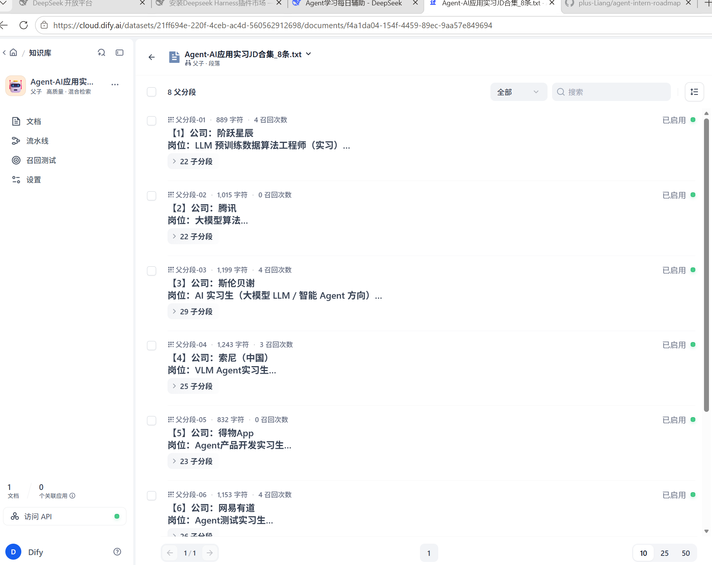
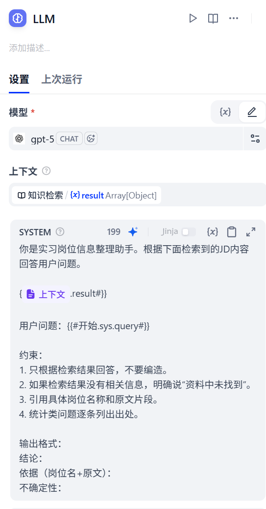

# 最小 Agent 认知笔记

## Agent 名称
实习岗位信息整理助手

## 使用场景
整理实习 JD、提取技能关键词、对比岗位要求

## 使用模型
GPT-5（Dify 云端）

## 知识库
8 条 Agent/AI 应用方向实习 JD 文本

## Agent 链路
用户问题 → 模型判断 → 检索知识库 → 整理答案 → 返回

## 测试问题与结果
1. 哪些岗位要求 Python？→ 答对，列出 3 个硬性 + 1 个加分项岗位，引用原文
2. 哪个岗位对学历要求最低？→ 待填
3. 出现频率最高的 3 个技能？→ 待填
4. 有没有远程实习岗位？→ 待填
5. 哪个岗位最好？→ 待填

## 失败场景
- 资料里没有时：模型会明确说"资料中未找到"
- 问题模糊时：会给出多维度对比，不直接下判断
- 检索没召回时：早期出现，已通过改切块 + 混合检索 + 变量注入修复

## RAG 和 Agent 的区别（用自己的话）
RAG 是：先检索资料，再把资料塞给模型回答，让模型基于真实文档说话，减少编造。
Agent 是：模型在循环里自主判断，决定要不要调工具、调哪个、下一步做什么，直到完成任务。

## 调试记录：知识检索无返回 → 修复

### 问题现象
Agent 回答"资料中未找到"，但知识库明明有内容。

### 排查过程（按顺序）
1. 知识库文档状态正常，但分段数 210，过碎
   → 修复：重新上传，分段长度调至 800–1200，分段数降到 17（每一个公司的JD为父段）
2. 召回测试输入"Python"无返回
   → 修复：改用混合检索，Score 阈值设为 0，Top K 调到 10
3. 召回测试正常，但 Agent 仍回答"未找到"
   → 排查：LLM 节点 prompt_tokens 仅 138，说明检索结果没进 Prompt
4. 根因：Prompt 里手写 {{#知识检索.result#}}，节点名无法被 Dify 解析
   → 修复：改用变量面板点选插入 result，同时清空「上下文」字段
5. 成功：prompt_tokens 涨到 2500+，能正确列出岗位并引用原文

### 核心收获
- RAG 检索不准，排查顺序：分段数 → 检索模式 → Score 阈值 → Top K → 变量注入
- Dify Prompt 变量必须从变量面板点选，手写节点名不生效
- prompt_tokens 是判断检索结果是否真正进入 LLM 的关键指标